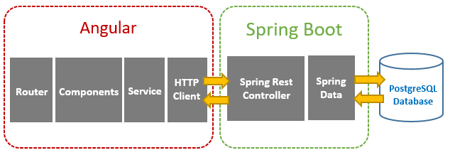
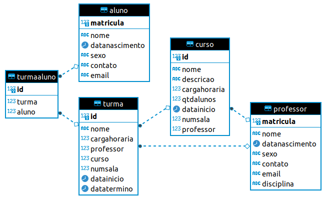

# Projeto Escola: Escola-Back
Este é um projeto que exemplifica como trabalhar com "Angular 11 + SpringBoot". A arquitetura deste foi montada conforme o seguinte esquema:



Ao ativar o Back acessar a documentação no Swagger:
http://localhost:8080/laboratorio/swagger-ui/index.html

Ao ativar o Front acessar a aplicação em:
http://localhost:4200

Mais Detalhes do Front: https://github.com/fernandoans/escola-front

## Ferramentas Utilizadas
Para esta parte foram utilizadas as seguintes tecnologias:
* Java - versão 8.0
* Spring Boot - versão 2.4.4
* SpringFox - versão 3.0.0
* Lombok - versão 1.18.20

Para a parte do front-end (EscolaFront) foram utilizadas as seguintes tecnologias:
* Angular 11
* Bootstrap 4.0

## Compilar
Ativar o ambiente produtivo
```
$ java jar -Dspring.profiles.active=prod escola-back.jar
```

Ativar o ambiente não produtivo
```
$ java jar -Dspring.profiles.active=dev escola-back.jar
```
## Modelagem do Banco
Para o banco de dados foi utilizado o PostgreSQL, conforme o seguinte M&R (Modelo de Entidade e Relacionamento):



Conforme o seguinte Script de criação:

```
create schema escola;

create table escola.professor (
  matricula int not null, 
  nome varchar(255), 
  datanasc date,
  sexo bpchar(1),
  contato varchar(50),
  email varchar(150),
  disciplina varchar(150),
  primary key (matricula)
);
    
create table escola.curso (
  id SERIAL not null,
  nome varchar(255), 
  descricao TEXT, 
  cargahoraria int, 
  qtdalunos int, 
  datainicio date, 
  numsala int,
  professor int,
  primary key (id),
  foreign key (professor) references escola.professor(matricula)
);	
	
create table escola.aluno (
  matricula int not null, 
  nome varchar(255), 
  datanasc date,
  sexo bpchar(1),
  contato varchar(50),
  email varchar(150),
  primary key (matricula)
);

create table escola.turma (
  id SERIAL not null,
  nome varchar(255), 
  cargahoraria int, 
  professor int,
  curso int,
  numsala int,
  datainicio date,
  datatermino date,
  primary key (id),
  foreign key (professor) references escola.professor(matricula),
  foreign key (curso) references escola.curso(id)
);

create table escola.turmaaluno (
  id SERIAL not null,
  turma int not null,
  aluno int not null,
  primary key (id),
  foreign key (turma) references escola.turma(id),
  foreign key (aluno) references escola.aluno(matricula)
);

```


